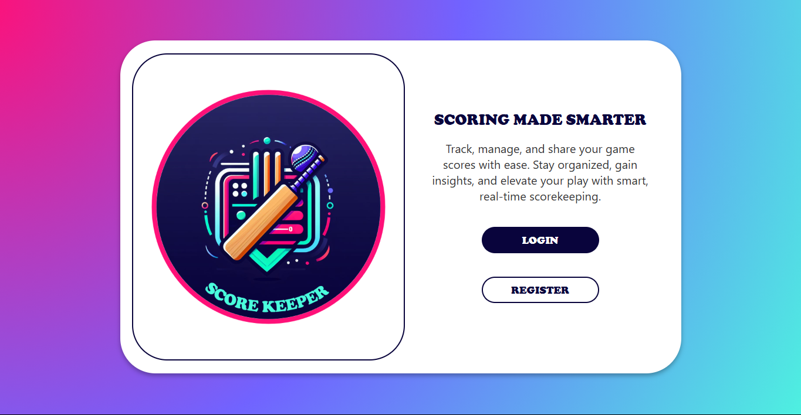
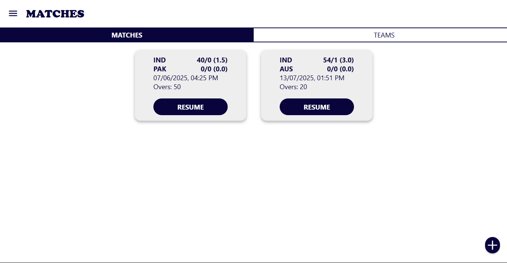
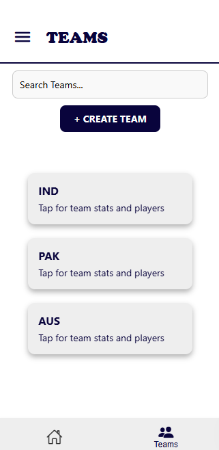
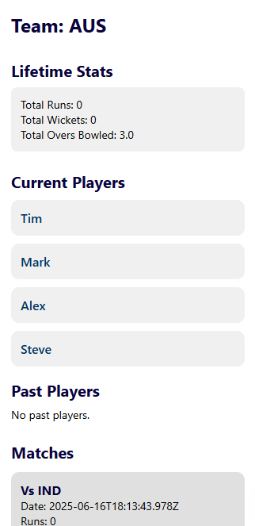

# 🏏 Score Keeper – Cricket Match Management App

A mobile-first app that helps you manage cricket matches like a pro — track teams, players, and scores effortlessly.

## Description

**Score Keeper** is built for scorers, organizers, and cricket enthusiasts who want a lightweight yet powerful solution for managing cricket matches. The app allows you to create teams, link players to user accounts, set up matches with overs and toss, and track scores and stats in real time.

Built with **React Native**, **Expo**, and **Firebase**, all core functionalities are complete and functional. UI screens for some modules are still in development.

## Features ✅

- 🔐 **Login & Authentication** (Firebase)
- 🏠 **Home Dashboard**
- 👥 **Team Management** – create, view, and update teams
- 🧑 **Player Profiles** – each player is uniquely linked to an email address
- 🏏 **Match Creation** – includes toss, overs, and innings setup
- 📊 **Live Score Tracking** – over-by-over input with real-time updates
- 📋 **Full Match Summary & Export** – complete scorecard and downloadable stats
- 🧮 **Player Performance Analytics**
- 🏆 **[Coming Soon] Tournament Support** – organize matches into structured tournaments
- 📺 **[Coming Soon] Live Score Streaming** – scoreboard overlay for YouTube/live events

> 🔧 All features are implemented and functional. Some UI screens are under design; screenshots will be added as visuals are completed.

## Technologies Used

- **React Native** – cross-platform development
- **Expo** – development framework and build system
- **Firebase** – for authentication, Firestore database, and cloud storage

## Screenshots

> ⚠ Screens shown are from development previews. Full mobile UI will be polished soon.

### 🔐 Login Screen (Desktop)

### 🏠 Home/Matches Screen (Desktop)

### 👥 Teams Screen (Mobile) & 🧑 Team Stats Screen (Mobile)

  
  <view/>
  

<!-- Match UI and stats screen images to be added later -->

## Future Enhancements

- 🎥 **Live YouTube Score Streaming** with auto-updating scoreboard
- 🏆 **Tournament Creation & Leaderboards**
- 🧾 Match attendance and umpire notes
- 📱 Offline mode with auto-sync on reconnect
- 🌍 Multi-language support
